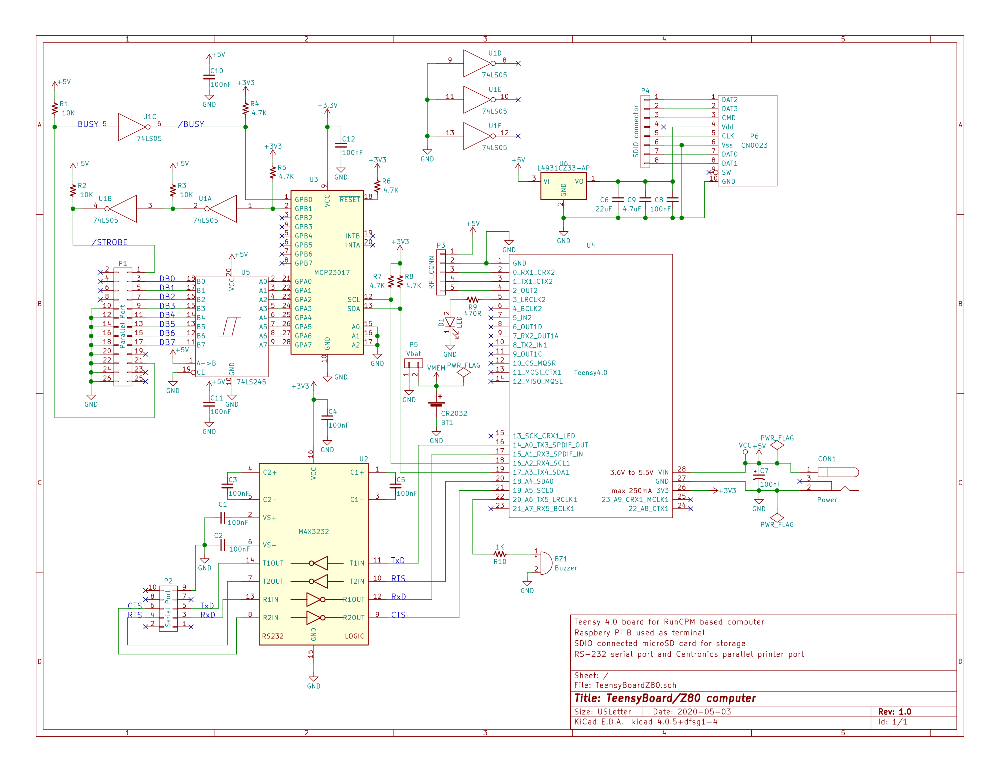

# Teensy Board/Z80 - A Teensy4.0 based ZCPR3.3/ZSDOS Z80 computer

## Schematic

I've been asked "why didn't you use a Teensy 4.1 with the built in uSD
holder?" The simple answer is that I designed this before the 4.1 was
announced.

And as to why all the thru hole parts were used when surface mount 
would have allowed either a smaller board or more features in the same
amount of space, this was a "use as many parts that I actually have on
hand" project.
